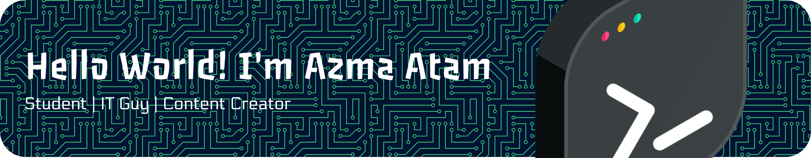

# Hi there, I'm **Azma Atam** 

## 🚀 About Me
Passionate Full-Stack Developer specializing in Laravel and modern web technologies. I love crafting efficient, scalable applications and contributing to open-source. Currently diving deep into Laravel ecosystem!

## 📊 GitHub Stats

   

## 🛠️ Tech Stack & Tools

## 🔥 Currently...
- 🔭 Working on Laravel projects & portfolio
- 🌱 Learning advanced Laravel (Eloquent, Livewire, Inertia)
- 👯 Open to collaborate on open-source web apps
- 💬 Ask me about Laravel, PHP, full-stack dev
- 📫 Reach me: azmaatam@example.com (update with real)
- ⚡ Fun fact: Laravel lover since 2023!

## 📈 Activity Graph

## 💬 Connect with Me

  

---

⭐ **Thanks for visiting my profile! Let's connect and build something awesome together! 🚀**

